# Behaviorial Cloning Project

Self-Driving Car NanoDegree

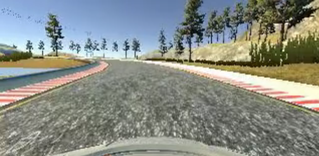

## Overview

This repository contains starting files for the Behavioral Cloning Project.

In this project, we will use deep neural networks and convolutional neural networks to clone driving behavior. We will train, validate and test a model using Keras. The model will output a steering angle to an autonomous vehicle.

In the simulator, we can steer a car around a track for data collection. We'll use image data and steering angles to train a neural network and then use this model to drive the car autonomously around the track.


To meet specifications, the project will require five files: 

* model.py (script used to create and train the model)
* drive.py (script to drive the car - feel free to modify this file)
* model.h5 (a trained Keras model)
* a report writeup file (either markdown or pdf)
* video.mp4 (a video recording of your vehicle driving autonomously around the track for at least one full lap)


The goals / steps of this project are the following:

* Use the simulator to collect data of good driving behavior 
* Design, train and validate a model that predicts a steering angle from image data
* Use the model to drive the vehicle autonomously around the first track in the simulator. The vehicle should remain on the road for an entire loop around the track.
* Summarize the results with a written report

### Dependencies
This lab requires:

* [CarND Term1 Starter Kit](https://github.com/udacity/CarND-Term1-Starter-Kit)

The lab enviroment can be created with CarND Term1 Starter Kit. Click [here](https://github.com/udacity/CarND-Term1-Starter-Kit/blob/master/README.md) for the details.


## Details About Files In This Directory

### `drive.py`

Usage of `drive.py` requires we have saved the trained model as an h5 file, i.e. `model.h5`. See the [Keras documentation](https://keras.io/getting-started/faq/#how-can-i-save-a-keras-model) for how to create this file using the following command:
```sh
model.save(filepath)
```

Once the model has been saved, it can be used with drive.py using this command:

```sh
python drive.py model.h5
```

The above command will load the trained model and use the model to make predictions on individual images in real-time and send the predicted angle back to the server via a websocket connection.

Note: There is known local system's setting issue with replacing "," with "." when using drive.py. When this happens it can make predicted steering values clipped to max/min values. If this occurs, a known fix for this is to add "export LANG=en_US.utf8" to the bashrc file.

#### Saving a video of the autonomous agent

```sh
python drive.py model.h5 run1
```

The fourth argument, `run1`, is the directory in which to save the images seen by the agent. If the directory already exists, it'll be overwritten.

```sh
ls run1

[2017-01-09 16:10:23 EST]  12KiB 2017_01_09_21_10_23_424.jpg
[2017-01-09 16:10:23 EST]  12KiB 2017_01_09_21_10_23_451.jpg
[2017-01-09 16:10:23 EST]  12KiB 2017_01_09_21_10_23_477.jpg
[2017-01-09 16:10:23 EST]  12KiB 2017_01_09_21_10_23_528.jpg
[2017-01-09 16:10:23 EST]  12KiB 2017_01_09_21_10_23_573.jpg
[2017-01-09 16:10:23 EST]  12KiB 2017_01_09_21_10_23_618.jpg
[2017-01-09 16:10:23 EST]  12KiB 2017_01_09_21_10_23_697.jpg
[2017-01-09 16:10:23 EST]  12KiB 2017_01_09_21_10_23_723.jpg
[2017-01-09 16:10:23 EST]  12KiB 2017_01_09_21_10_23_749.jpg
[2017-01-09 16:10:23 EST]  12KiB 2017_01_09_21_10_23_817.jpg
...
```

The image file name is a timestamp of when the image was seen. This information is used by `video.py` to create a chronological video of the agent driving.

### `video.py`

```sh
python video.py run1
```

Creates a video based on images found in the `run1` directory. The name of the video will be the name of the directory followed by `'.mp4'`, so, in this case the video will be `run1.mp4`.

Optionally, one can specify the FPS (frames per second) of the video:

```sh
python video.py run1 --fps 48
```

## Writeup

### Step 0: Collect data

In this project,I use the [sample driving data](https://d17h27t6h515a5.cloudfront.net/topher/2016/December/584f6edd_data/data.zip) provided by Udacity.

### Step 1:Exploration data

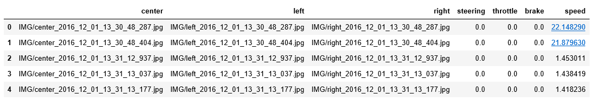


Each row in this sheet correlates the image with the steering angle, throttle, brake, and speed of the car.I mainly use the image of three cameras and steering angle to train model.

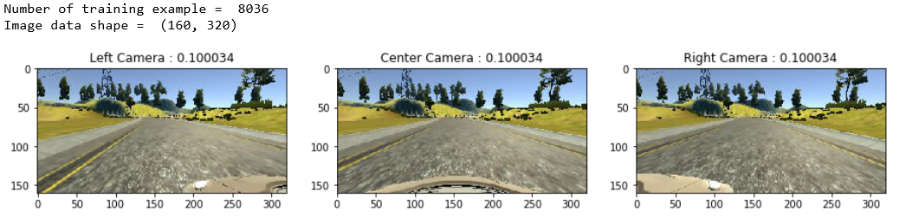

The dataset provides images of the three cameras (left, center, right) and the angles of the center camera images.Obviously, when the model is to be trained with the image of the left and right cameras, it is necessary to figure out how much to add or subtract from the center angle

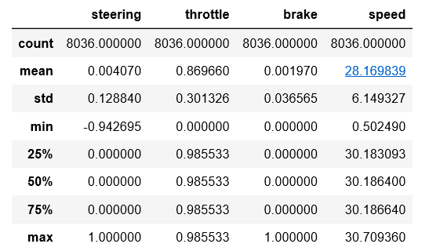


Steering data distribution is unbalance.Steering angle ranges from -1 to 1.But,more than 50% of steering angle is 0.
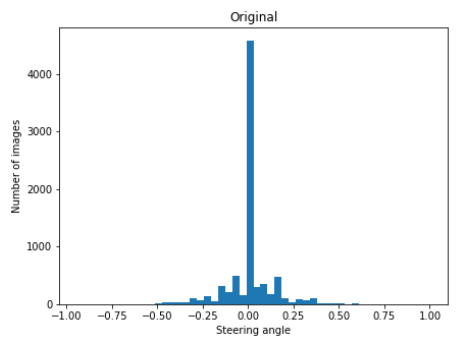

### Step 2:Data pregrocessing

#### Image pregrocessing


The following operations will be used for image preprocessing:
* EqualizeHist : Apply histogram equilization on V channel of HSV
* Cropping : Crop 25 pixels from the bottom of the image and 55 pixels from top of the image
* Flipping : Randomly flip image
* Resize : Resize the image to (66,200),which is the input size of Nvidia model


#### Multiple Cameras

From the perspective of the left camera, the steering angle would be less than the steering angle from the center camera. From the right camera's perspective, the steering angle would be larger than the angle from the center camera.
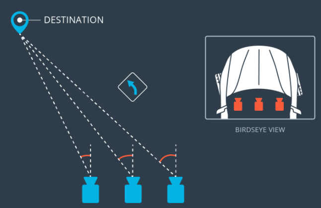

Calculate the angle of the left and right camera images


```python
import math

camera_pos = ['left','center','right']
angle_offset = {'center':0,'left':0.2,'right':0.2}

def get_angle(camera_position,center_angle,image_index):
    
    if camera_position == 'left':
        #left camera 
        left_angle_tan = angle_offset['left'] + math.tan(center_angle)
        angle = math.atan(left_angle_tan)
    elif camera_position == 'right':
        #right camera
        right_angle_tan = math.tan(center_angle) - angle_offset['right'] 
        angle = math.atan(right_angle_tan)
    else:
        angle = center_angle
    
    if angle >= 1.0 :
        angle = 1.0
    elif angle <= -1.0:
        angle = -1.0
       
    
    return angle
```

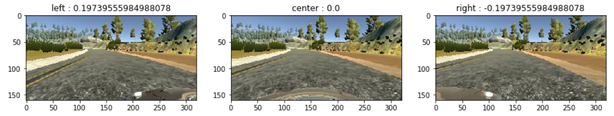

#### Weighted sample

As discussed about,the distribution of angle data is unbalance,and similar to the Gaussian distibution.Therefore, on the basis of the original data, the data of left and right cameras are added, and the weight of sampling conforms to the Gaussian distribution. 


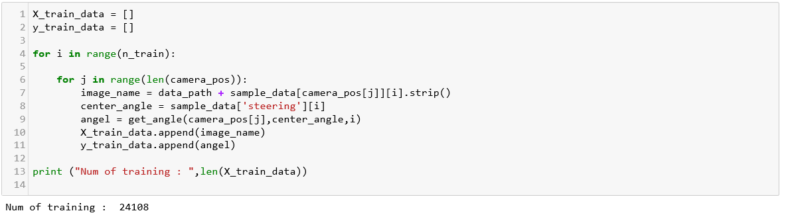


```python
from scipy.stats import norm

def get_weight(y_train,num_bins=10):
    
    weights_bin = np.zeros(num_bins)
    weights = np.zeros(len(y_train))
    
    nums,bins = np.histogram(y_train,num_bins)    
    prob = norm.pdf(bins,0,1.0)

    for i in range(num_bins):
        if nums[i]:
            weights_bin[i] = prob[i+1]
        else :
            weights_bin[i] = 0
            nums[i] = 1
    
    weights_bin = weights_bin / np.sum(weights_bin)
    weights_bin = weights_bin / nums
    
    bin_index = np.digitize(y_train,bins)
       
    for i in range(len(y_train)):
        if bin_index[i] > num_bins :
            bin_index[i] -= 1
        weights[i] = weights_bin[bin_index[i]-1] 
       
    return weights,prob
```

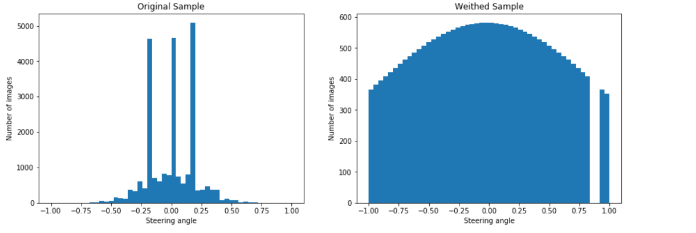

#### Generator

Generator generates one batch size data at a time.It randomly selects a batch size data based on the weight of each training sample.If augment data is ture,It randomly flip the sample.


```python
def generator(X_train,y_train,batch_size = 32,augment = False):
    
    num_sample = len (y_train)
    X_train_index = range(num_sample)
    #get the weight of each sample
    weights = np.zeros(len(y_train),dtype = np.float32)
    weights,_ = get_weight(y_train,num_bins=50)
    
    while True:
        X_train_index,X_weights = sklearn.utils.shuffle(X_train_index,weights)
        
        #generate data for each batch 
        for offset in range(0,num_sample,batch_size):
            # select a batch samples base on the weight of each sample
            X_batch_index = np.random.choice(X_train_index,batch_size,replace=True,p=X_weights)
            
            images = np.zeros((len(X_batch_index),160,320,3),dtype = np.float32)
            angles = np.zeros((len(X_batch_index),),dtype = np.float32)

            for i in range(len(X_batch_index)):
                
                image_index = X_batch_index[i]
                
                # original data
                image_name = X_train[image_index]
                image = cv2.imread(image_name)
                image = cv2.cvtColor(image,cv2.COLOR_BGR2RGB)
                angle = y_train[image_index]
                # augment data
                if augment :
                    #Applies histogram equilization on V channel of HSV  
                    if (np.random.choice([0,1]) == 0):
                        image = EqualizeHist_brightness(image)
                    
                    # randomly flip
                    if (np.random.choice([0,1]) == 0):
                        image = cv2.flip(image,1)
                        angle = - angle 
                    
                images[i] = image
                angles[i] = angle
                           
            yield (images,angles)
```

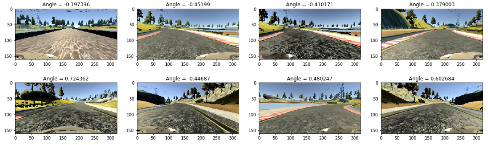

### Step 3: Build model

In this project，I use the [Nvidia architecture](https://devblogs.nvidia.com/deep-learning-self-driving-cars/).I resize the image to (66,200),use the ReLU as activaion function and use TruncatedNormal to initializer the Convolutional layer weights. Regularizer function L2 apply to the kernel weights matrix.


```python
import numpy as np
import keras
from keras.models import Sequential
from keras.layers import Dense, Dropout, Flatten,Lambda
from keras.layers import Conv2D, MaxPooling2D,Cropping2D
from keras.optimizers import SGD
from keras import regularizers
from keras import backend as K
import tensorflow as tf

# image shape
x_image = (160,320,3)

model = Sequential()

#Cropping
model.add(Cropping2D(cropping = ((55,25),(0,0)),input_shape = x_image))
#resize images
model.add(Lambda(lambda x: tf.image.resize_images(x,(66,200),0)))

#normalize the image data
model.add(Lambda(lambda x: x/255.0 - 0.5))

# Nvidia Model
model.add(Conv2D(24, (5, 5),strides=(2, 2), kernel_initializer='TruncatedNormal',activation='relu',kernel_regularizer=regularizers.l2(0.01)))
model.add(Conv2D(36, (5, 5),strides=(2, 2), kernel_initializer='TruncatedNormal',activation='relu',kernel_regularizer=regularizers.l2(0.01)))
model.add(Conv2D(48, (5, 5),strides=(2, 2), kernel_initializer='TruncatedNormal',activation='relu',kernel_regularizer=regularizers.l2(0.01)))

model.add(Conv2D(64, (3, 3), kernel_initializer='TruncatedNormal',activation='relu',kernel_regularizer=regularizers.l2(0.01)))
model.add(Conv2D(64, (3, 3), kernel_initializer='TruncatedNormal',activation='relu',kernel_regularizer=regularizers.l2(0.01)))


model.add(Flatten())
model.add(Dense(100,activation='relu'))
model.add(Dense(50,activation='relu'))
model.add(Dense(10,activation='relu'))
model.add(Dense(1,activation = 'tanh'))

model.compile(loss = 'mean_squared_error',optimizer = 'adam')
```

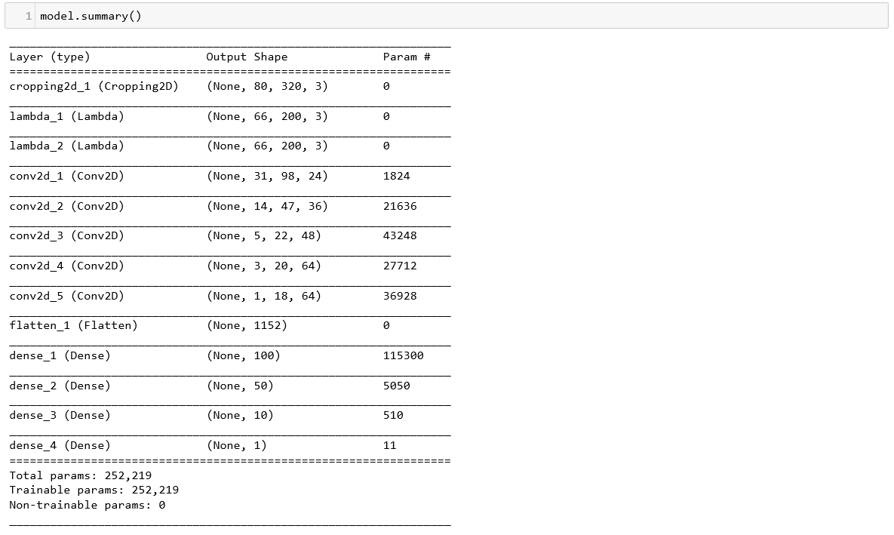

Split sample data to training data and validation data

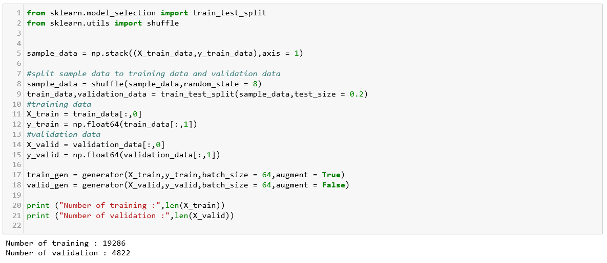

### Step 4 : Train model

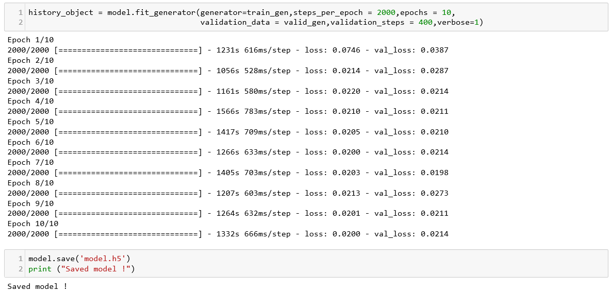

Show training loss and validation loss

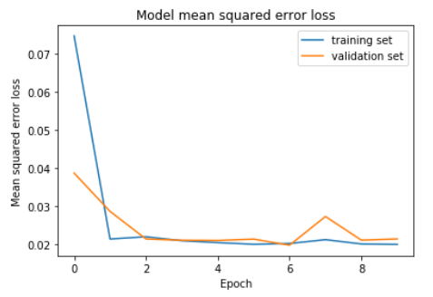

### Step 5 : Test model

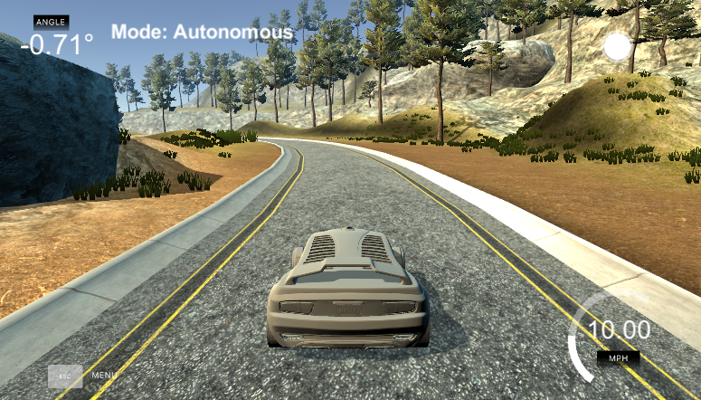

### Step 6 : Summary

After training the model many times,when launching the simulator and entering autonomous mode,the car can move around the track.In this project,I think the following are very important:

* Data preprocessing : Calculating the angles of the left and right camera images,and adjusting the angle offset according to the performance of the car in the simulator.If the angle offset is too big,the car swings easily on the straight road.
* Weighted sampling : The distribution of original data is unbalance.When training model with original data,the car can easily run out of the track when crossing the curve.After adjusting the weight according to the Gaussian distribution, the car can handle the curve better. 

